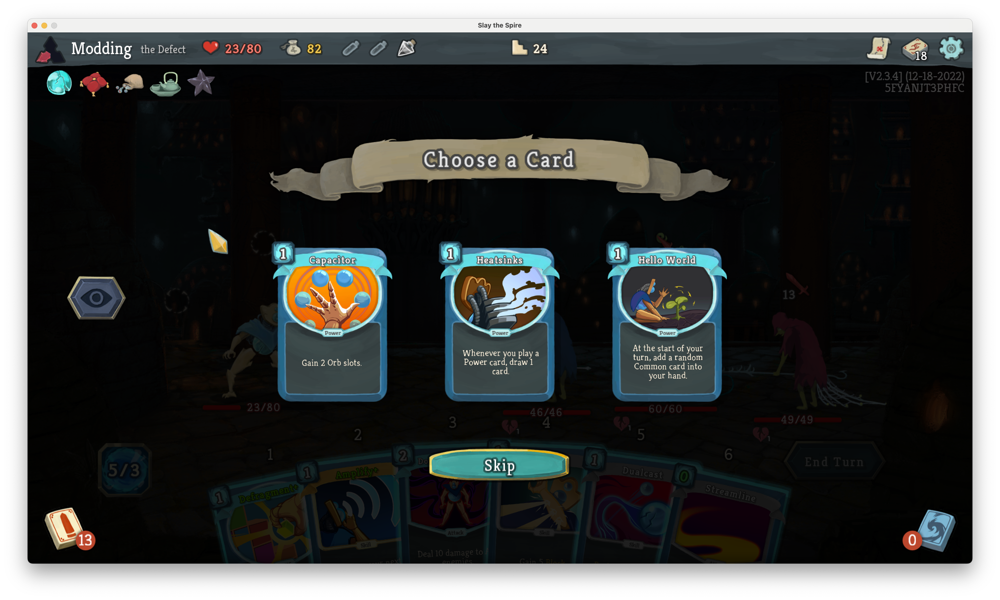
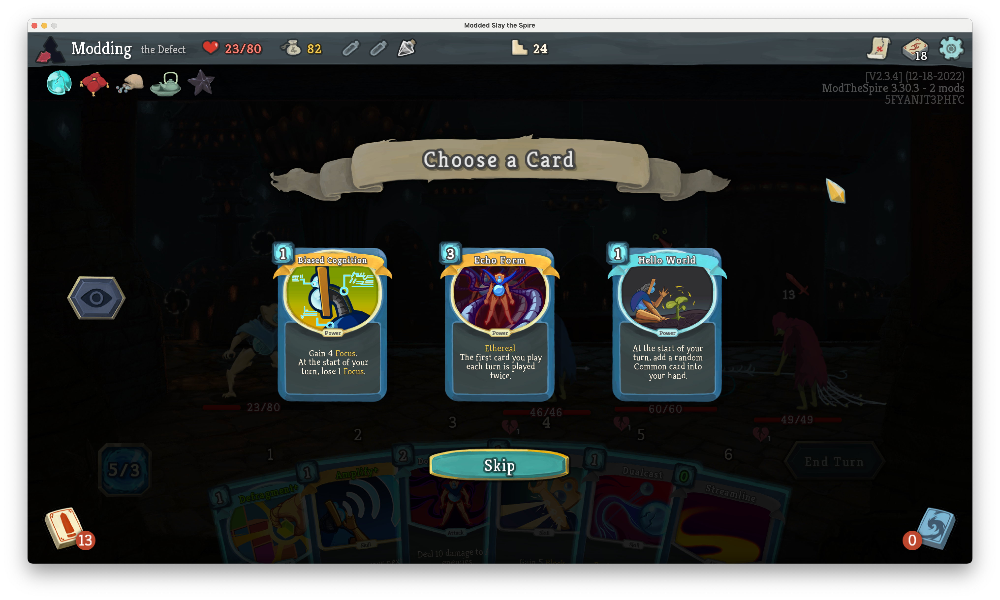
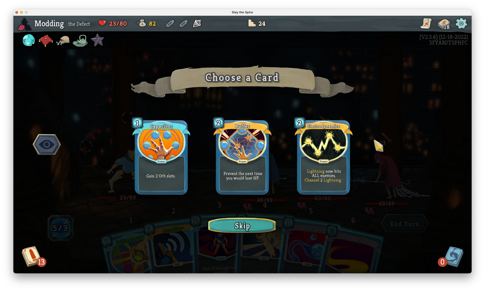
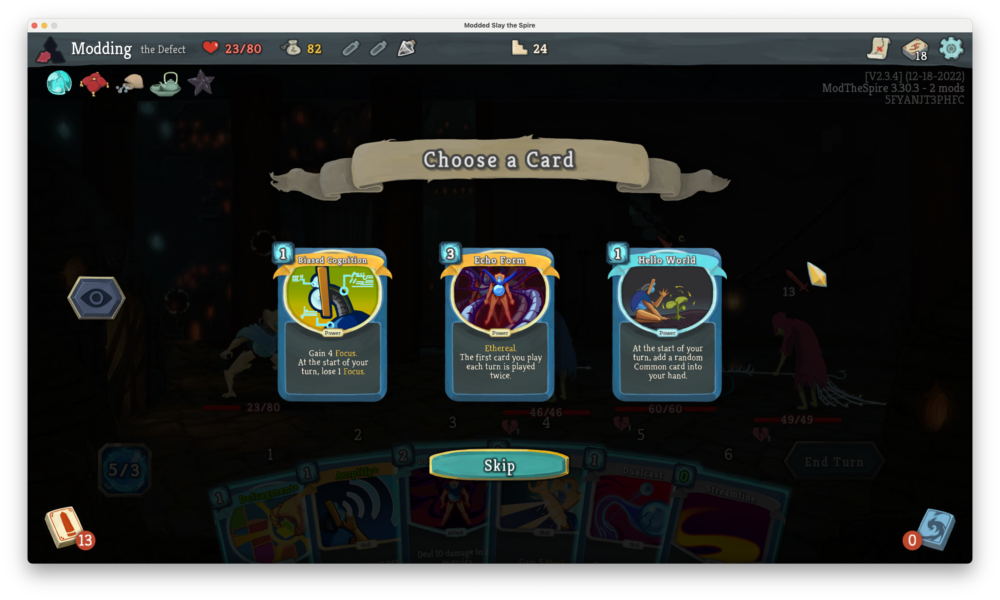
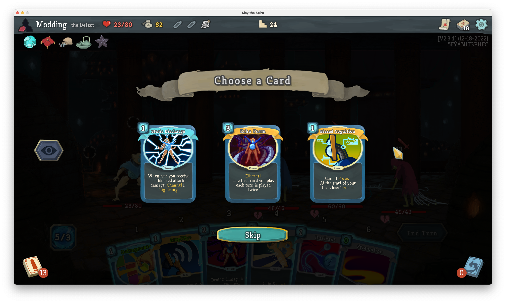
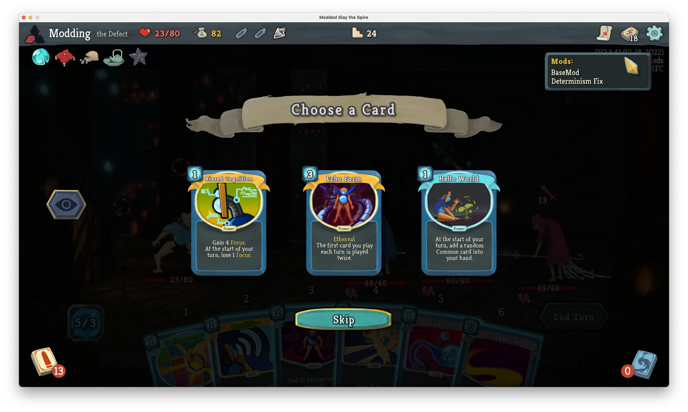

# Determinism Fix

This mod fixes a bug in [Slay the Spire](https://store.steampowered.com/app/646570/Slay_the_Spire/) that makes
seeded runs non-deterministic.

## Context

Given the same starting conditions (seed, ascension level, unlocks, etc.), you should be able to reproduce any Slay
the Spire run by performing the same actions in the same order.

However, there exists a bug with card discovery (specifically from a potion or the
[Discovery](https://slay-the-spire.fandom.com/wiki/Discovery) card) where one of the random number generators (RNGs) is
called an arbitrary number of times. For the rest of the floor, any random behavior that relies on that RNG will be
non-deterministic.

This is likely a bug since the
[Foreign Influence](https://slay-the-spire.fandom.com/wiki/Foreign_Influence) card performs similar behavior, but
without this issue. For more details, see the comparison below.

## Installation

Install this mod by subscribing to it in the [Steam workshop](https://steamcommunity.com/workshop/filedetails/?id=3156775649).


## The bug explained

In the example below, we start a floor by opening an attack potion and then a power potion. In a vanilla Slay the Spire
run, the cards offered by the power potion are non-deterministic. If we save the run and continue, we'll usually get
different cards.

| Attempt | Vanilla                     | w/ Determinism Fix     |
| --- |-----------------------------|------------------------|
| 1 |  |  |
| 2 |  |  |
| 3 |  |  |

Under the hood, these potions use a `DiscoveryAction` to generate cards. The cards are generated within the `update`
method:

```java
// DiscoveryAction.java
public void update() {
      ArrayList generatedCards;
      if (this.returnColorless) {
         generatedCards = this.generateColorlessCardChoices();
      } else {
         generatedCards = this.generateCardChoices(this.cardType);
      }

      if (this.duration == Settings.ACTION_DUR_FAST) {
         AbstractDungeon.cardRewardScreen.customCombatOpen(generatedCards, CardRewardScreen.TEXT[1], this.cardType != null);
         this.tickDuration();
      } else {
         // ...
      }
  }
```

The `update` method is called (roughly) every "tick" of the game loop. Every time that happens, one of the
`generate[...]CardChoices` methods is called which then advances the underlying RNG (`cardRandomRNG`) at least three
times.

Compare that with Foreign Influence. This card has nearly identical behavior, but a different implementation via
`ForeignInfluenceAction`:

```java
// ForeignInfluenceAction.java
public void update() {
	if (this.duration == Settings.ACTION_DUR_FAST) {
		AbstractDungeon.cardRewardScreen.customCombatOpen(this.generateCardChoices(), CardRewardScreen.TEXT[1], true);
		this.tickDuration();
	} else {
		// ...
	}
}
```

The logic within the `this.duration == Settings.ACTION_DUR_FAST` `if` statement is only called once (since
`this.duration` is immediately decremented by `tickDuration`), so `generateCardChoices` is only called once.

Returning to our example, using the attack potion performs a `DiscoveryAction` which calls `cardRandomRNG` an arbitrary
number of times. At this point, performing any actions that rely on `cardRandomRNG` will be non-deterministic (generally
any random actions that arise from playing cards, such as which enemies are hit by
[Bouncing Flask](https://slay-the-spire.fandom.com/wiki/Bouncing_Flask)). The cards generated by a power potion rely on
`cardRandomRNG`, so they are non-deterministic.

> Note the attack potion in this example always generates the same cards. This is because the card reward screen is
> opened with whichever cards are generated on the first call to `update`. The subsequent calls to the
> `generate[...]CardChoices` methods are ignored, but they still advance `cardRandomRNG` (which is the problem!). This
> mod fixes this issue by preventing each `DiscoveryAction` from calling the `generate[...]CardChoices` methods more
> than once.

## Proposed fix

The developers are no longer working on Slay the Spire, but this bug could be fixed upstream by updating
`DiscoveryAction` to match `ForeignInfluenceAction`:

```diff
// DiscoveryAction.java
public void update() {
-     ArrayList generatedCards;
-     if (this.returnColorless) {
-        generatedCards = this.generateColorlessCardChoices();
-     } else {
-        generatedCards = this.generateCardChoices(this.cardType);
-     }
-
      if (this.duration == Settings.ACTION_DUR_FAST) {
+        ArrayList generatedCards;
+        if (this.returnColorless) {
+           generatedCards = this.generateColorlessCardChoices();
+        } else {
+           generatedCards = this.generateCardChoices(this.cardType);
+        }
+
         AbstractDungeon.cardRewardScreen.customCombatOpen(generatedCards, CardRewardScreen.TEXT[1], this.cardType != null);
         this.tickDuration();
      } else {
         // ...
      }
  }
```